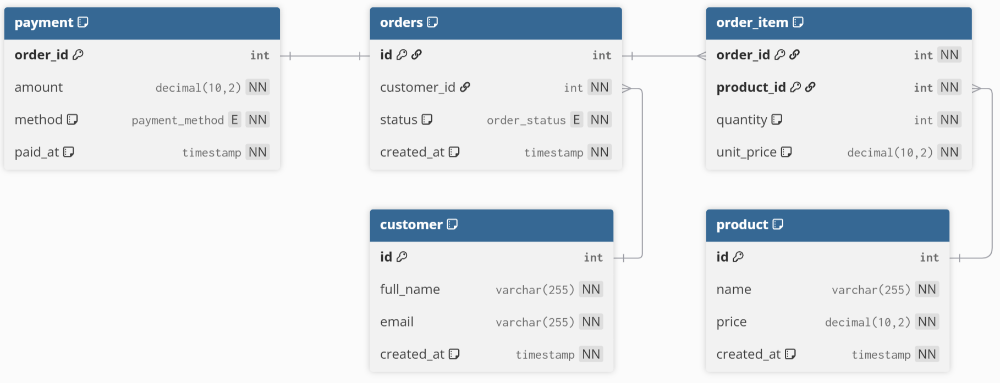

# E-Commerce API

> ⚠️ **This is a learning project.**  
> Developed as part of the course module *Backend-programmering i Java och SpringBoot* with focus on JPA.

Minimal REST API for managing products, customers, and orders.\
Built with Spring Boot, following layered architecture principles and
repository abstraction (supports both InMemory and JPA implementations).

------------------------------------------------------------------------

## Tech Stack

-   Java 21
-   Spring Boot
-   Spring Web
-   Spring Data JPA
-   MySQL (or InMemory repositories for development)

------------------------------------------------------------------------

## Domain Model

The database schema is illustrated below.

Interactive version available at:  
https://dbdiagram.io/d/Minimal-e-commerce-69a6e840a3f0aa31e1aa3d0f

------------------------------------------------------------------------

## API Endpoints

| Method   | Path                             | Request DTO             | Response DTO              |
|----------|----------------------------------|-------------------------|---------------------------|
| `POST`   | `/customers`                     | `UpsertCustomerRequest` | `CustomerResponse`        |
| `GET`    | `/customers/{id}`                | —                       | `CustomerResponse`        |
| `GET`    | `/customers`                     | —                       | `List<CustomerResponse>`  |
| `PUT`    | `/customers/{id}`                | `UpsertCustomerRequest` | `CustomerResponse`        |
| `DELETE` | `/customers/{id}`                | —                       | —                         |
| `GET`    | `/customers/{customerId}/orders` | —                       | `List<OrderResponse>`     |
| `POST`   | `/products`                      | `UpsertProductRequest`  | `ProductResponse`         |
| `GET`    | `/products/{id}`                 | —                       | `ProductResponse`         |
| `GET`    | `/products`                      | —                       | `List<ProductResponse>`   |
| `PUT`    | `/products/{id}`                 | `UpsertProductRequest`  | `ProductResponse`         |
| `DELETE` | `/products/{id}`                 | —                       | —                         |
| `POST`   | `/orders`                        | `CreateOrderRequest`    | `OrderResponse`           |
| `GET`    | `/orders/{id}`                   | —                       | `OrderDetailsResponse`    |
| `POST`   | `/orders/{orderId}/items`        | `AddOrderItemRequest`   | `OrderItemResponse`       |
| `GET`    | `/orders/{orderId}/items`        | —                       | `List<OrderItemResponse>` |
| `PATCH`  | `/orders/{orderId}/cancel`       | —                       | `OrderResponse`           |
| `POST`   | `/orders/{orderId}/pay`          | `PayOrderRequest`       | `PaymentResponse`         |

------------------------------------------------------------------------

## Architecture

The project follows a layered structure:

api → Controllers & DTOs\
service → Business logic\
domain → Core models & repository interfaces\
persistence\
├─ inmemory\
└─ jpa

Repository interfaces are defined in the domain layer, allowing:

-   InMemory implementations for testing
-   JPA/MySQL implementations for production

------------------------------------------------------------------------

## Run Configuration

Example `application.properties`:

    spring.datasource.url=jdbc:mysql://localhost:3306/ecommerce
    spring.datasource.username=root
    spring.datasource.password=yourpassword
    spring.jpa.hibernate.ddl-auto=validate

------------------------------------------------------------------------

## Development Notes

-   Use `ddl-auto=validate`
-   Spring Profiles can be used to switch between InMemory and JPA
    repositories
